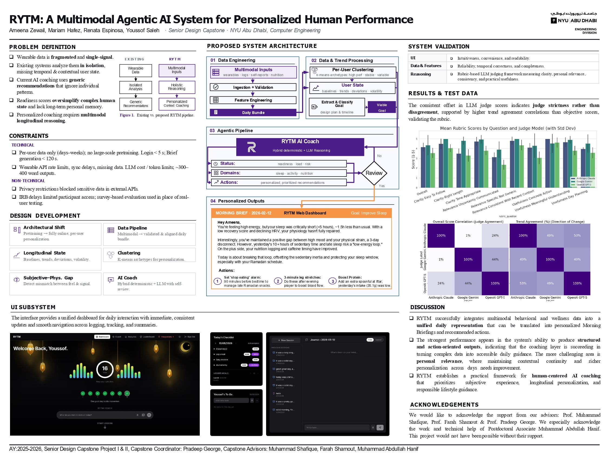
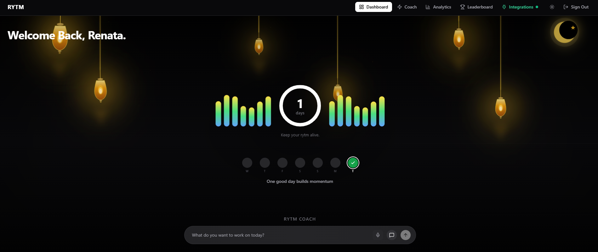
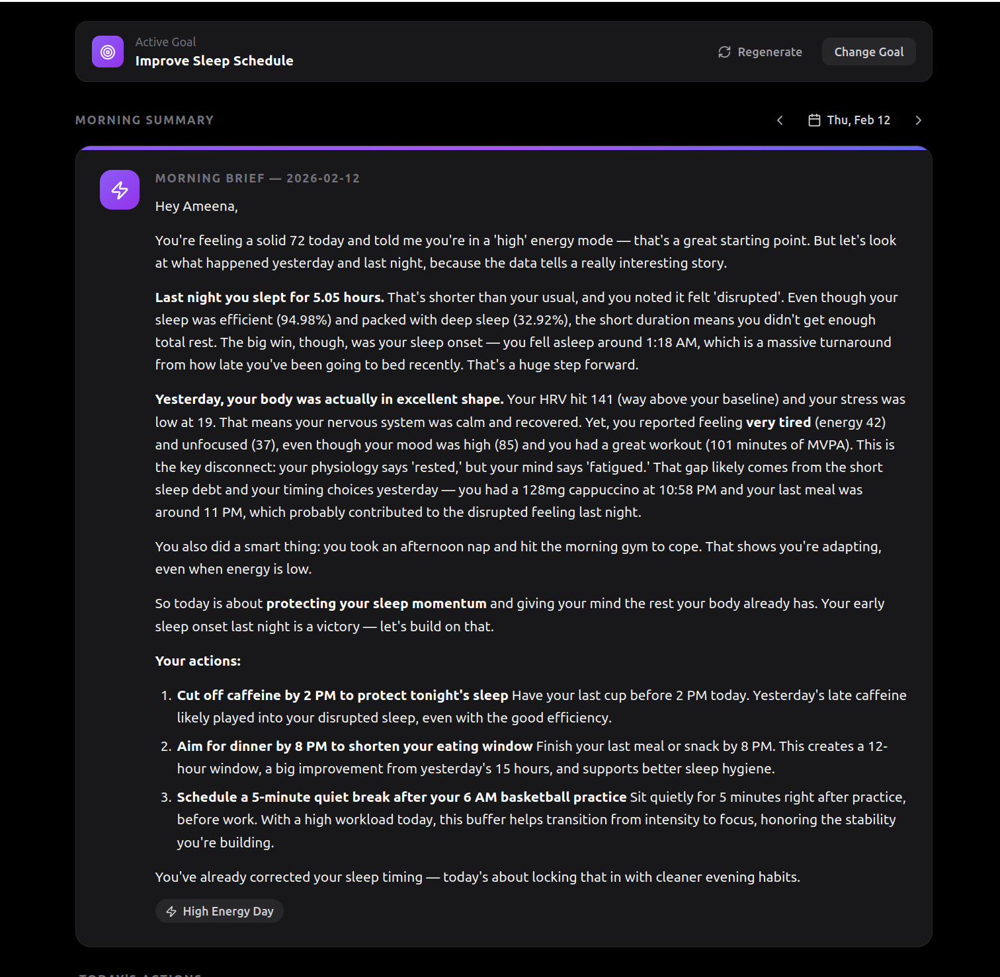

# rytm

A modern web platform for human performance optimization and wellbeing data collection. 
**[Visit the RYTM landing page](https://rytm.rena-espinosa.com/)** for a general overview of the whole project.


## Visual Overview

The screenshots below, together with the a one pager diagram, provide a structured overview of RYTM’s concept, user experience, and core functionality.

### Project One-Pager

Project overview. Architecture, features, and results from research study for NYUAD Capstone.

<p align="center">
  
</p>

### Dashboard

The main home screen: daily streak, weekly progress, and the RYTM Coach entry point.

<p align="center">
  
</p>

### AI Insights

Personalized morning briefs that synthesize sleep, nutrition, mood, and wearable data into narrative insights and actionable next steps.

<p align="center">
  
</p>

## Tech Stack

- **Frontend framework**: Next.js 14+ App Router + TypeScript
- **Styling**: Tailwind CSS
- **Authentication + Database**: Supabase
- **AI layer**: OpenRouter API and OpenAI API
- **Python pipeline**: Coach pipeline under `python/coach`
- **Deployment**: Vercel / Node.js-compatible hosting

---

## Getting Started

### Prerequisites

Before setting up the project, make sure you have:

- Node.js 18+ and npm
- Python 3.10+ recommended
- Git
- Access to the private GitHub repository
- A Supabase account and project
- An OpenRouter API key
- An OpenAI API key, if using OpenAI-backed features

---

## 1. Clone the Repository

This repository is private, so your GitHub account must have access to the `rytm-nyuad` organization/repository.

GitHub no longer supports password authentication for Git operations over HTTPS. Use one of the following authentication methods.

### Option A: Clone using GitHub CLI

First authenticate:

```bash
gh auth login
````

Follow the prompts, then check that authentication worked:

```bash
gh auth status
```

Then clone the repository:

```bash
git clone https://github.com/rytm-nyuad/rytm.git
cd rytm
```

### Option B: Clone using SSH

If you have SSH set up with GitHub:

```bash
git clone git@github.com:rytm-nyuad/rytm.git
cd rytm
```

### Option C: Clone using HTTPS with a Personal Access Token

```bash
git clone https://github.com/rytm-nyuad/rytm.git
cd rytm
```

When prompted for your password, paste a GitHub Personal Access Token instead of your GitHub password.

---

## 2. Install Node Dependencies

From the project root:

```bash
npm install
```

You may see npm warnings about deprecated packages or vulnerabilities from transitive dependencies. These warnings do not necessarily prevent the app from running.

To inspect the issues:

```bash
npm audit
```
---

## 3. Set Up Environment Variables

Copy the example environment file:

```bash
cp .env.example .env.local
```

Then open `.env.local` and fill in the required values.

At minimum, the app may require values such as:

```env
NEXT_PUBLIC_SUPABASE_URL=https://<your-supabase-project-url>
NEXT_PUBLIC_SUPABASE_ANON_KEY=<your-supabase-anon-key>
SUPABASE_SERVICE_ROLE_KEY=<your-supabase-service-role-key>

OPENROUTER_API_KEY=<your-openrouter-api-key>
OPENAI_API_KEY=<your-openai-api-key>
```

### LLM provider switches (coach)

You can choose OpenAI or OpenRouter independently for:

1. **Morning coach plan generation** (`run_pipeline.py` / `langgraph_pipeline.py`)
2. **Behavior-profile clustering interpreter** (`run_behavior_profile_update.py`)

```env
# Morning coach pipeline (default: openrouter)
COACH_LLM_PROVIDER=openai
# COACH_LLM_MODEL=gpt-4o-mini

# Behavior-profile interpreter (default: openai)
BEHAVIOR_PROFILE_LLM_PROVIDER=openai
# BEHAVIOR_PROFILE_LLM_MODEL=gpt-4o-mini
```

| Variable | Values | Default | Uses key |
|----------|--------|---------|----------|
| `COACH_LLM_PROVIDER` | `openai` \| `openrouter` | `openrouter` | matching provider key |
| `BEHAVIOR_PROFILE_LLM_PROVIDER` | `openai` \| `openrouter` | `openai` | matching provider key |

Optional model overrides: `COACH_LLM_MODEL`, `BEHAVIOR_PROFILE_LLM_MODEL`.

Journal summary extraction (runs during morning prep) also supports both providers:

```env
# If unset: uses OpenRouter when OPENROUTER_API_KEY exists, else OpenAI
JOURNAL_SUMMARY_LLM_PROVIDER=openai
# JOURNAL_SUMMARY2_MODEL=gpt-4o-mini
```

### Journal context enrichment (apply once)

Apply `supabase/journal_summary2_context_enrichment.sql` in the Supabase SQL editor. It:

* Adds `narrative_summary`, `topics`, `commitments`, and `recurring_topics` to `journal_summary2`
* Creates `user_journal_context2` (rolling narrative arc, open commitments, recurring topics, recent day summaries)

Morning prep then keeps that rolling context updated for a future conversational coach.
---

## 4. Set Up the Python Coach Pipeline

The project includes a Python-based coach pipeline under `python/coach`.

From the project root:

```bash
cd python/coach
python3 -m venv .venv
source .venv/bin/activate
pip install -r requirements.txt
```

Then return to the project root before running the Next.js app:

```bash
cd ../..
```

If you are on Windows, activate the virtual environment with:

```bash
.venv\Scripts\activate
```

---

## 5. Run the Development Server

From the project root:

```bash
npm run dev
```

Then open:

```text
http://localhost:3000
```

---

## Try the New Coach Features From the App

These features run when you generate a morning plan from the Coach UI.

### What was added

* **Versioned behavior profiles** (`user_behavior_profiles1`) built from per-user K-means clustering over `daily_features1`
* **Deterministic quality gates** (cluster size, silhouette, subsample ARI stability) before LLM interpretation / activation
* **Atomic active-profile promotion** via `promote_user_behavior_profile` RPC
* **Refresh due only after 21 days AND enough new feature days** since prior `data_window_end`
* **LLM cluster interpretation** that writes a coaching profile (summary, `cluster_0`/`1`/`2`, primary rule)
* **Morning pipeline reads the latest active profile** from the DB (hardcoded profiles removed)
* **Provider switch** for morning coach and behavior-profile LLMs (`openai` or `openrouter`)

### App flow (recommended)

1. Ensure `.env.local` has Supabase keys + the LLM key for the providers you selected.
2. Ensure the Python venv exists under `python/coach/.venv` (the API spawns those scripts).
3. Start the app:

```bash
npm run dev
```

4. Sign in at `http://localhost:3000`.
5. Create / keep an **active goal** (Coach page requires one).
6. Submit today’s **overall score / morning check-in** on the dashboard.
7. Open **Coach** (`http://localhost:3000/coach`) and generate / refresh the morning plan.

On that morning run:

* `POST /api/coach/morning-run` runs `python/coach/run_pipeline.py`
* If a behavior-profile refresh is due, it also spawns `run_behavior_profile_update.py` in the background
* Today’s plan uses the **current** active profile (or empty if none yet); a newly generated profile applies on the **next** morning run

### Verify in Supabase

After a successful run, check:

* `daily_plans1` / `plan_actions1` — morning plan + actions
* `user_behavior_profiles1` — `status = active` row with `summary`, `cluster_interpretations_json`, `primary_coaching_rule`, `quality_evaluation_json`
* Rejected candidates keep stats/quality evidence with `status = rejected` (active profile unchanged)

---

## Optional: CLI Smoke Tests (same features)

Use these when you want to exercise the Python side without the UI.

### Force a behavior-profile refresh

```bash
cd python/coach

# Windows
.venv\Scripts\python.exe run_behavior_profile_update.py <user_id> manual_force

# macOS / Linux
.venv/bin/python run_behavior_profile_update.py <user_id> manual_force
```

`manual` skips if a refresh is not due; `manual_force` overrides a stuck `running` job.

### Run the morning coach pipeline directly

```bash
cd python/coach

# Windows
.venv\Scripts\python.exe run_pipeline.py <user_id> <YYYY-MM-DD> <overall_score> <ingestion_run_id>

# macOS / Linux
.venv/bin/python run_pipeline.py <user_id> <YYYY-MM-DD> <overall_score> <ingestion_run_id>
```

The JSON result includes `debug.behavior_profile`, `debug.llm_provider`, and `debug.llm_model`.

---

## Project Structure

```text
src/
├── app/
│   ├── (auth)/              # Authentication routes
│   ├── api/                 # API routes (includes /api/coach/morning-run)
│   ├── coach/               # Morning coach UI
│   ├── consent/             # Consent flow and signature page
│   ├── dashboard/           # Main dashboard UI
│   ├── layout.tsx           # Root layout
│   ├── page.tsx             # Landing page
│   └── globals.css          # Global styles
├── components/
│   ├── dashboard/           # Dashboard widgets and modals
│   └── ui/                  # Reusable UI components
├── lib/
│   ├── coach/               # Coach readiness + behavior-profile due checks
│   ├── db/                  # Database logic
│   ├── llms/                # LLM configuration and prompts
│   ├── supabase/            # Supabase client utilities
│   └── utils.ts             # Utility functions
├── types/                   # TypeScript types

python/
└── coach/                   # Morning coach + behavior-profile pipeline
    ├── langgraph_pipeline.py
    ├── run_pipeline.py
    ├── run_behavior_profile_update.py
    ├── behavior_clustering.py
    ├── behavior_profile_agent.py
    ├── behavior_profile_store.py
    └── llm_config.py

supabase/                    # All database schemas and migrations (applied manually)
├── user_behavior_profiles.sql
├── user_behavior_profiles_quality_gates.sql
├── journal_summary2_context_enrichment.sql
├── function_rpcs.sql
├── journal_schema.sql
├── meal_processing_schema.sql
└── ...

public/                      # Static assets
```

---

## Main Features

* Landing page with authentication calls to action
* Supabase authentication
* Consent flow with signature requirement
* Dashboard for wellbeing and performance data collection
* Daily check-ins and logging flows
* Meal and water logging
* Image upload support for meal logs using Supabase Storage
* AI-guided and free-form journaling
* Enriched journal summaries (commitments, recurring topics, narrative context) for coaching continuity
* Python coach pipeline for personalized morning plans
* Per-user behavior profiles from clustering + LLM interpretation
* Configurable OpenAI / OpenRouter providers for coach and profile jobs
* Secure database access patterns using Supabase and RLS

---

## License

Private research project for NYUAD Capstone.
